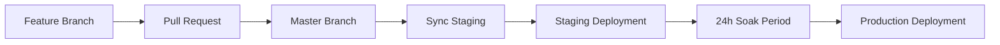

# Deployment Lifecycle

This document outlines the updated deployment lifecycle for the Game Diary application, implementing a simplified master → staging → production flow with a 2 business days soak period.

## Overview

The deployment lifecycle follows these principles:

1. **Feature branches** → **Master** (via PR)
2. **Master** → **Staging** (automatic, for 24h soak)
3. **Staging** → **Production** (manual trigger after soak period)

## Branch Strategy

### Master Branch

- **Purpose**: Main development branch
- **Protection**: Requires PR reviews and CI checks
- **Deployment**: Automatically triggers staging deployment

### Staging Branch

- **Purpose**: Testing environment with latest master code
- **Sync**: Automatically synchronized with master
- **Deployment**: Automatic deployment to staging environment
- **Soak Period**: 2 business days before production eligibility

### Production Branch

- **Purpose**: Production deployment
- **Source**: Staging branch (after soak period)
- **Deployment**: Manual trigger with soak period validation

## Workflow Overview

### 1. Feature Development



### 2. Automated Workflows

#### Sync Staging Workflow

- **Trigger**: Push to master branch
- **Action**: Synchronizes staging branch with master
- **Result**: Staging branch contains exact master code

#### Staging Deployment Workflow

- **Trigger**: Push to staging branch (after sync)
- **Action**: Deploys to staging environment
- **Result**: Staging environment updated, soak period begins

#### Production Deployment Workflow

- **Trigger**: Manual workflow dispatch or scheduled (MTWTh at 10am Pacific)
- **Validation**: 2 business days soak period check
- **Action**: Deploys to production environment
- **Result**: Production environment updated

## Detailed Workflow Steps

### Step 1: Feature Development

1. Create feature branch from latest master
2. Develop and test feature
3. Create pull request to master
4. Pass CI checks and code review
5. Merge to master

### Step 2: Staging Deployment (Automatic)

1. **Sync Staging Workflow** triggers on master push
   - Synchronizes staging branch with master
   - Ensures staging contains exact master code

2. **Staging Deployment Workflow** triggers on staging push
   - Deploys to staging environment
   - Runs post-deployment verification
   - Begins 2 business days soak period

### Step 3: Soak Period (2 Business Days)

- **Duration**: 2 business days (16 business hours) in Pacific time
- **Purpose**: Extended testing and validation
- **Activities**:
  - Manual testing in staging environment
  - Performance monitoring
  - User acceptance testing
  - Bug identification and fixes

### Step 4: Production Deployment (Manual)

1. **Validation**: Check soak period completion
2. **Deployment**: Deploy staging code to production
3. **Verification**: Post-deployment checks
4. **Monitoring**: Production environment monitoring

## Business Hours Calculation

Business hours are calculated as:

- **Business Days**: Monday-Friday
- **Business Hours**: 8 hours per business day
- **2 Business Days**: 16 business hours (Pacific time)
- **Example**: Monday 9 AM Pacific → Wednesday 9 AM Pacific

## Emergency Procedures

### Bypass Soak Period

In emergency situations, the soak period can be bypassed:

1. Use `skip-soak-check` option in production workflow
2. Requires manual approval
3. Should be used sparingly

### Emergency Rollback

For critical production issues, emergency rollbacks are available:

#### GitHub Actions Workflow

1. Go to Actions → Emergency Rollback
2. Select environment (Production/Staging)
3. Choose rollback target (previous deployment or specific URL)
4. Provide reason for rollback
5. Trigger rollback

#### Command Line Script

```bash
# Rollback to previous deployment
./scripts/emergency-rollback.sh -e production -r "Critical bug in latest deployment"

# Rollback to specific deployment
./scripts/emergency-rollback.sh -e staging -t https://game-diary-abc123.vercel.app -r "Test rollback"

# Force rollback (bypass confirmation)
./scripts/emergency-rollback.sh -e production -r "Critical issue" -f
```

#### Rollback Features

- **Automatic validation**: Checks rollback target accessibility
- **Domain verification**: Ensures domain is working after rollback
- **Audit trail**: Logs all rollback actions with reasons
- **Safety checks**: Prevents rolling back to same deployment
- **Health monitoring**: Verifies application health after rollback

### Hotfix Deployment

For critical fixes:

1. Create hotfix branch from master
2. Apply minimal fix
3. PR to master
4. Follow normal deployment process
5. Consider emergency bypass if necessary

## Workflow Files

### Core Workflows

- `.github/workflows/sync-staging.yml` - Synchronizes staging with master
- `.github/workflows/staging.yml` - Deploys to staging environment
- `.github/workflows/production.yml` - Deploys to production with soak validation
- `.github/workflows/emergency-rollback.yml` - Emergency rollback for critical issues

### Supporting Workflows

- `.github/workflows/pre-deployment.yml` - Pre-deployment validation
- `.github/workflows/deploy-and-verify.yml` - Deployment and verification
- `.github/workflows/preview.yml` - Preview deployments for PRs

## Environment Configuration

### Staging Environment

- **URL**: Staging-specific domain
- **Database**: Staging database
- **Purpose**: Testing and validation

### Production Environment

- **URL**: https://www.game-diary.io
- **Database**: Production database
- **Purpose**: Live application

## Monitoring and Alerts

### Deployment Monitoring

- Automated deployment status checks
- Post-deployment verification
- Health checks and monitoring

### Soak Period Tracking

- Business hours calculation
- Deployment age tracking
- Readiness validation

## Best Practices

### Development

1. Always create feature branches from master
2. Keep PRs small and focused
3. Ensure comprehensive testing
4. Pass all CI checks before merging

### Deployment

1. Monitor staging environment during soak period
2. Test thoroughly before production deployment
3. Use emergency bypass sparingly
4. Monitor production after deployment

### Communication

1. Notify team of staging deployments
2. Track soak period progress
3. Coordinate production deployments
4. Document any issues or bypasses

## Troubleshooting

### Common Issues

#### Staging Sync Failures

- Check branch protection rules
- Verify workflow permissions
- Review merge conflicts

#### Soak Period Validation

- Verify business hours calculation
- Check staging deployment status
- Review workflow logs

#### Production Deployment Failures

- Check environment configuration
- Verify secrets and permissions
- Review deployment logs

### Support

For deployment issues:

1. Check workflow logs in GitHub Actions
2. Review environment configuration
3. Contact development team
4. Document issues for future reference

## Migration from Previous System

### Changes Made

1. **Simplified Branch Strategy**: Removed deployment branch
2. **Direct Master → Staging**: Automatic synchronization
3. **Soak Period Validation**: 2 business days requirement
4. **Streamlined Workflows**: Reduced complexity

### Benefits

1. **Simplified Process**: Easier to understand and maintain
2. **Consistent Deployments**: Staging always matches master
3. **Quality Assurance**: Extended testing period
4. **Reduced Risk**: Better validation before production

### Migration Steps

1. Update branch protection rules
2. Configure new workflows
3. Test deployment process
4. Train team on new workflow
5. Monitor initial deployments
