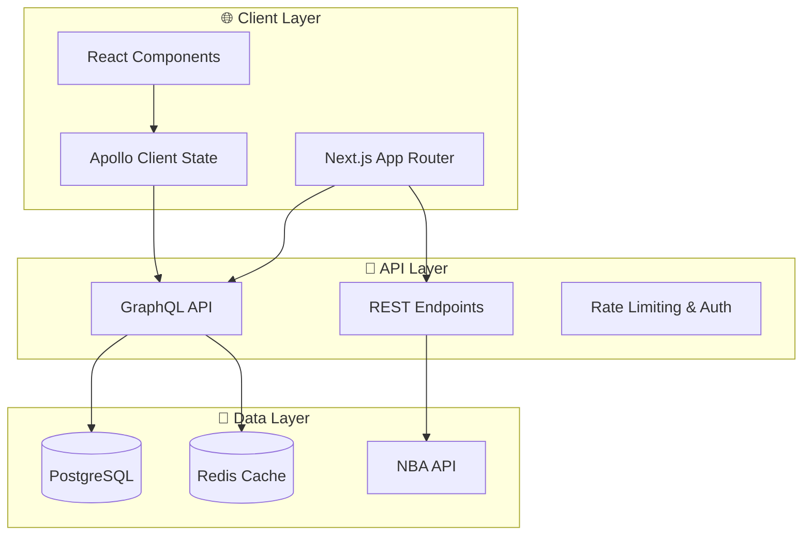

# 🏗️ Game Diary Architecture & Optimization Guide

This document provides a comprehensive overview of the Game Diary application architecture, optimization strategies, and development guidelines.

## 📋 Table of Contents

- [🎯 Overview](#-overview)
- [🏗️ Application Architecture](#-application-architecture)
- [📁 Directory Structure](#-directory-structure)
- [⚡ Performance Optimizations](#-performance-optimizations)
- [🔧 Development Workflow](#-development-workflow)
- [📊 Monitoring & Analytics](#-monitoring--analytics)
- [🚀 Deployment Strategy](#-deployment-strategy)
- [🔄 Continuous Improvement](#-continuous-improvement)

## 🎯 Overview

Game Diary is a modern, full-stack sports tracking application built with:

- **Frontend**: Next.js 15 (App Router), React 19, TypeScript 5.8, Tailwind CSS
- **Backend**: GraphQL with Apollo Server, PostgreSQL with Drizzle ORM, Redis
- **Infrastructure**: Vercel (hosting), Neon (database), Upstash (Redis)
- **Authentication**: Clerk for user management and social features
- **Monitoring**: Vercel Analytics, Speed Insights, custom performance monitoring

### Key Design Principles

1. **Performance First**: Every feature is designed with performance in mind
2. **Type Safety**: Comprehensive TypeScript coverage with strict configuration
3. **Modular Architecture**: Feature-based organization for scalability
4. **Developer Experience**: Optimized tooling and workflows
5. **Quality Assurance**: Automated testing, linting, and validation

## 🏗️ Application Architecture



### Core Technologies Stack

#### Frontend Stack

- **Next.js 14**: App Router with React 18 Server Components
- **TypeScript 5.8**: Strict type checking with modern features
- **Tailwind CSS**: Utility-first CSS with custom design system
- **Radix UI**: Accessible component primitives
- **Apollo Client**: GraphQL client with intelligent caching

#### Backend Stack

- **GraphQL**: Type-safe API with Apollo Server
- **Drizzle ORM**: Type-safe database queries and migrations
- **PostgreSQL**: Primary database with advanced features
- **Redis**: Caching and session management
- **Clerk**: Authentication and user management

#### Development Tools

- **pnpm**: Fast package manager with workspace support
- **ESLint**: Code linting with TypeScript support
- **Prettier**: Code formatting with Tailwind plugin
- **Husky**: Git hooks for quality assurance
- **Jest**: Unit testing framework

## 📁 Directory Structure

### Optimized Organization

```
game-diary/
├── 📁 src/                  # Source code
│   ├── 📁 app/              # Next.js App Router
│   │   ├── 📁 api/          # API routes
│   │   ├── 📁 protected/    # Auth-required pages
│   │   ├── 📁 sports/       # Sports-specific pages
│   │   └── 📁 _components/  # App-level shared components
│   ├── 📁 components/       # React components
│   │   ├── 📁 ui/           # Design system components
│   │   ├── 📁 features/     # Feature-specific components
│   │   └── 📁 common/       # Shared business components
│   ├── 📁 lib/              # Core library code
│   │   ├── 📁 core/         # Essential services
│   │   ├── 📁 graphql/      # GraphQL schema & resolvers
│   │   ├── 📁 db/           # Database layer
│   │   └── 📁 utils/        # Utility functions
│   └── 📁 hooks/            # Custom React hooks
├── 📁 scripts/              # Build and automation scripts
├── 📁 docs/                 # Documentation
├── 📁 public/               # Static assets
└── 📁 coverage/             # Test coverage and performance reports
```

### Component Architecture

#### Design System Hierarchy

```
UI Components (Base Layer)
├── Button, Input, Card (Primitives)
├── Form, Dialog, Dropdown (Compositions)
└── Layout, Navigation (Structural)

Common Components (Business Layer)
├── ReactionPicker, CommentsSection (Social)
├── ThemeToggle, ErrorBoundary (Global)
└── LoadingSpinner, EmptyState (Feedback)

Feature Components (Domain Layer)
├── GameLogModal, GameCard (Games)
├── FriendRequestButton, UserProfile (Users)
└── NotificationCenter (Notifications)
```

## ⚡ Performance Optimizations

### Build Optimization

#### Next.js Configuration

```javascript
// next.config.js optimizations
export default {
  poweredByHeader: false,
  compress: true,
  images: {
    formats: ['image/webp', 'image/avif'],
    minimumCacheTTL: 60,
  },
  experimental: {
    optimizeCss: true,
    optimizePackageImports: ['lucide-react', '@radix-ui/react-icons', 'date-fns'],
  },
  webpack: config => {
    // Enhanced caching and bundle splitting
    config.optimization.splitChunks = {
      chunks: 'all',
      cacheGroups: {
        vendor: {
          test: /[\\/]node_modules[\\/]/,
          name: 'vendors',
          chunks: 'all',
        },
      },
    };
    return config;
  },
};
```

#### TypeScript Configuration

```json
{
  "compilerOptions": {
    "target": "es2022",
    "moduleResolution": "bundler",
    "verbatimModuleSyntax": true,
    "noUncheckedIndexedAccess": true,
    "exactOptionalPropertyTypes": true
  }
}
```

### Runtime Performance

#### Component Optimization

- **Memoization**: React.memo for expensive components
- **Code Splitting**: Dynamic imports for heavy features
- **Lazy Loading**: React.lazy for route-based splitting
- **Bundle Analysis**: Regular bundle size monitoring

#### Caching Strategy

```typescript
// GraphQL caching policy
const cachePolicy = {
  typePolicies: {
    Game: {
      fields: {
        teams: { merge: false },
        statistics: { merge: false },
      },
    },
  },
  defaultOptions: {
    watchQuery: { errorPolicy: 'all' },
    query: { errorPolicy: 'all' },
  },
};
```

### Database Performance

#### Query Optimization

- **Prepared Statements**: Type-safe queries with Drizzle
- **Connection Pooling**: Optimized database connections
- **Indexing Strategy**: Strategic database indexes
- **Query Batching**: DataLoader for N+1 prevention

#### Caching Layers

```typescript
// Redis caching implementation
const cacheConfig = {
  defaultTTL: 300, // 5 minutes
  keyPrefix: 'game-diary:',
  strategies: {
    games: 3600, // 1 hour
    users: 1800, // 30 minutes
    stats: 7200, // 2 hours
  },
};
```

## 🔧 Development Workflow

### Quality Assurance Pipeline

```bash
# Pre-commit hooks
pnpm lint:fix          # Fix linting issues
pnpm format            # Format code
pnpm typecheck         # Type checking
pnpm test              # Run tests

# Build validation
pnpm validate:full     # Complete validation suite
pnpm perf:measure      # Performance measurement
pnpm check:size        # Bundle size analysis
```

### Script Organization

#### Development Scripts

```bash
pnpm dev               # Development server with Turbo
pnpm build:analyze     # Build with bundle analysis
pnpm perf:build        # Performance-optimized build
```

#### Quality Scripts

```bash
pnpm validate          # Basic validation
pnpm validate:full     # Comprehensive validation
pnpm check:circular    # Circular dependency check
pnpm check:unused      # Unused code detection
```

#### Performance Scripts

```bash
pnpm perf:measure      # Measure build performance
pnpm perf:report       # Generate performance report
pnpm analyze:bundle    # Analyze bundle composition
```

## 📊 Monitoring & Analytics

### Performance Monitoring

#### Automated Metrics Collection

```typescript
interface PerformanceMetrics {
  buildTime: number;
  bundleSize: {
    total: number;
    pages: Record<string, number>;
    chunks: Record<string, number>;
  };
  typecheck: {
    time: number;
    errors: number;
  };
  dependencies: {
    production: number;
    development: number;
  };
}
```

#### Bundle Size Limits

```javascript
// size-limit configuration
module.exports = [
  {
    path: '.next/static/chunks/pages/**/*.js',
    limit: '200kb',
  },
  {
    path: '.next/static/chunks/app/**/*.js',
    limit: '300kb',
  },
];
```

### Continuous Monitoring

#### Performance Benchmarks

- **Build Time**: < 3 minutes target
- **Bundle Size**: < 5MB total
- **TypeScript Errors**: 0 tolerance
- **Test Coverage**: > 80% target

#### Alerting Thresholds

- Bundle size increase > 10%
- Build time increase > 20%
- New TypeScript errors
- Test failures

## 🚀 Deployment Strategy

### Build Optimization

#### Multi-stage Docker Build

```dockerfile
# Optimized Dockerfile
FROM node:22-alpine AS deps
WORKDIR /app
COPY package.json pnpm-lock.yaml ./
RUN npm install -g pnpm && pnpm install --frozen-lockfile

FROM node:22-alpine AS builder
WORKDIR /app
COPY --from=deps /app/node_modules ./node_modules
COPY . .
RUN pnpm build

FROM node:22-alpine AS runner
WORKDIR /app
COPY --from=builder /app/public ./public
COPY --from=builder /app/.next/standalone ./
COPY --from=builder /app/.next/static ./.next/static
EXPOSE 3000
CMD ["node", "server.js"]
```

#### Vercel Configuration

```json
{
  "buildCommand": "pnpm build",
  "framework": "nextjs",
  "installCommand": "npm install -g pnpm && pnpm install",
  "functions": {
    "app/api/**/*.ts": {
      "maxDuration": 60
    }
  }
}
```

### Environment Strategy

#### Development

- Hot reloading with Turbo
- Comprehensive error reporting
- Development-only debugging tools

#### Staging

- Production build with debug symbols
- Performance monitoring
- E2E testing

#### Production

- Optimized builds
- Error tracking
- Performance analytics

## 🔄 Continuous Improvement

### Performance Monitoring Process

1. **Automated Measurement**: Every build measures performance
2. **Trend Analysis**: Track performance over time
3. **Threshold Alerts**: Automated alerts for regressions
4. **Regular Audits**: Monthly performance reviews

### Optimization Roadmap

#### Short Term (Next Sprint)

- [ ] Implement lazy loading for heavy components
- [ ] Optimize GraphQL queries
- [ ] Add more granular caching

#### Medium Term (Next Quarter)

- [ ] Implement service worker for offline support
- [ ] Add bundle analysis CI checks
- [ ] Optimize database queries

#### Long Term (Next Release)

- [ ] Migrate to React Server Components
- [ ] Implement edge caching
- [ ] Add advanced performance monitoring

### Architecture Decision Records (ADRs)

#### ADR-001: Component Architecture

**Decision**: Feature-based component organization
**Rationale**: Better maintainability and team scalability
**Status**: Implemented

#### ADR-002: GraphQL vs REST

**Decision**: GraphQL for primary API, REST for external integrations
**Rationale**: Type safety and efficient data fetching
**Status**: Implemented

#### ADR-003: Bundle Optimization Strategy

**Decision**: Aggressive code splitting with route-based chunks
**Rationale**: Improved initial load performance
**Status**: In Progress

---

## 📚 Additional Resources

- [Performance Monitoring Guide](./docs/PERFORMANCE_MONITORING.md)
- [Component Development Guidelines](./src/components/README.md)
- [Database Optimization Guide](./docs/DATABASE_OPTIMIZATION.md)
- [Deployment Checklist](./docs/DEPLOYMENT_CHECKLIST.md)

---

_This document is automatically updated with each major architecture change. Last updated: [Current Date]_
